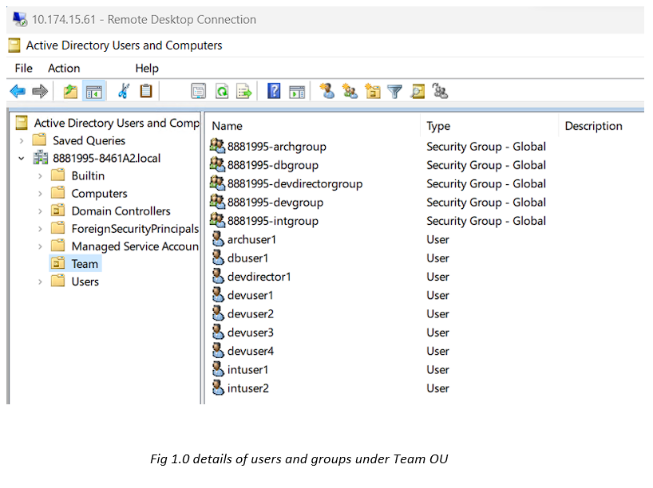

# 🛡️ Windows Server 2019 – NTFS & Active Directory Permissions Lab

This lab demonstrates how to configure **Active Directory Organizational Units (OUs), groups, users, and secure file access** using **Share & NTFS permissions**. The project applies **Role-Based Access Control (RBAC)** and the **Principle of Least Privilege**, with **Access-Based Enumeration (ABE)** for enhanced security and user experience.  

---

## 🚀 Objectives
- Create **Active Directory OUs, users, and groups** for different job functions.
- Implement **project-specific AD groups** (iOS & Android).
- Configure **NTFS & Share permissions** aligned with RBAC.
- Enable **Access-Based Enumeration (ABE)** for hidden folder visibility.
- Test and validate permissions using **Effective Access**.

---

## 🛠️ Lab Environment
- **Windows Server 2019**  
  - Domain Controller (8881995-A2DC) – AD DS & DNS  
  - Member File Server (8881995-A2MS) – Shared Folders & NTFS permissions  
- **Domain Name:** `8881995-8461A2.local`  
- **Client VM:** Windows 10/11 (domain-joined)  

---

## ⚙️ Tasks Performed

### 1️⃣ Job Function AD Objects
- Created an OU `Team` to organize groups and users.  
- Added job-function based groups:  
  - `8881995-devgroup` (Developers)  
  - `8881995-intgroup` (Integrators)  
  - `8881995-archgroup` (Architects)  
  - `8881995-dbgroup` (DB Analysts)  
  - `8881995-devdirectorgroup` (Development Director)  

📸 Screenshot:  

---

### 2️⃣ Project AD Objects
- Created project groups for secure resource access:  
  - `8881995-IOS_app` → devuser1, devuser2, intuser1, archuser1, dbuser1  
  - `8881995-Android_app` → devuser3, devuser4, intuser2, archuser1, dbuser1  

📸 Screenshot:  

---

### 3️⃣ Folder Structure & Shares
- Added a new disk (E:) on file server for project data.  
- Created **Projects** root folder with subfolders:  
  - `iOS` → `Brainstorming`  
  - `Android` → `Brainstorming`  
- Shared **Projects** root folder using best practices.  
- Enabled **Access-Based Enumeration (ABE)** to restrict folder visibility.  

📸 Screenshot:  

---

### 4️⃣ NTFS Permissions
- Applied **least privilege permissions** at folder level:  
  - `Projects` → Director group = **Read-only**  
  - `iOS` → iOS project group = **Read + Create Content**  
  - `iOS\Brainstorming` → iOS project group = **Modify**  
  - `Android` → Android project group = **Read + Create Content**  
  - `Android\Brainstorming` → Android project group = **Modify**  

📸 Screenshot:  

---

## 📌 Key Learnings
- Difference between **Share vs NTFS permissions** and their combined effect.  
- Implementing **RBAC** ensures scalable and secure access management.  
- **Access-Based Enumeration (ABE)** enhances security by hiding inaccessible folders.  
- Using **Effective Permissions** is critical for troubleshooting access issues.  
- Designed a secure, structured file system aligned with **least privilege principle**.  

---

## 🔗 Related Projects
- [WSUS & Active Directory Backup](https://github.com/BasilTAlias/WSUS-AD-Backup)  
- [Linux Infrastructure & Security Projects](https://github.com/BasilTAlias/Linux-Security)  
- [Scalable WordPress on AWS EKS](https://github.com/BasilTAlias/EKS-Project)  

---

## ✍️ Author
👨‍💻 Basil T Alias  
[LinkedIn](https://www.linkedin.com/in/basil-t-alias) | [Portfolio](https://basiltalias.site) | [Medium Blogs](https://medium.com/@basiltaliaz)
