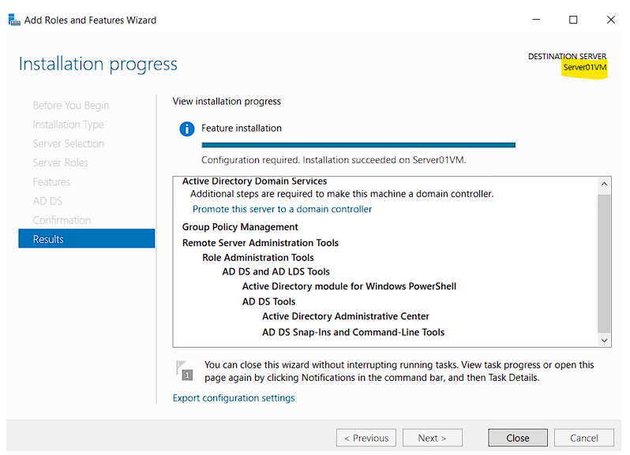
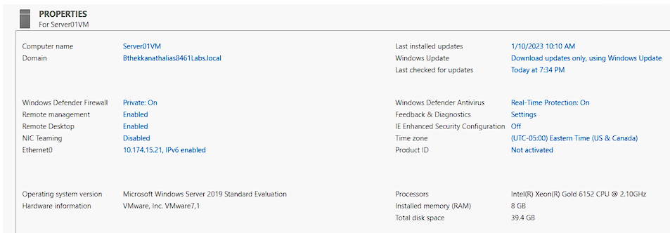
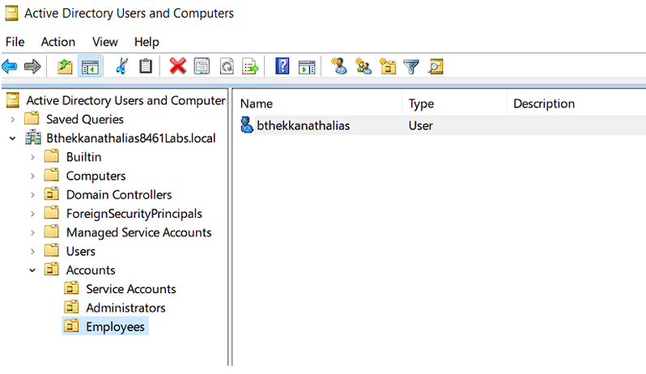

# 🛡️ NTFS & Active Directory Permissions Lab

This project demonstrates how to configure **Active Directory Organizational Units (OUs), users, groups, and NTFS/share permissions** in a Windows Server environment. It highlights **Role-Based Access Control (RBAC)**, **Access-Based Enumeration (ABE)**, and effective permissions troubleshooting—core skills for IT Support and System Administration.

---

## 🚀 Objectives
- Create **OUs, groups, and users** in Active Directory.
- Configure **NTFS & share permissions** for secure file access.
- Apply the principle of **least privilege** with RBAC.
- Test **Access-Based Enumeration (ABE)** to hide restricted folders.
- Verify permissions using **Effective Permissions**.

---

## 🛠️ Lab Environment
- **Windows Server 2019** (Domain Controller & File Server)
- **Active Directory Domain Services (AD DS)**
- **Users & Groups** created: HR, Finance, IT Support
- **Client Machine** (Windows 10/11) joined to domain

---

## ⚙️ Steps Performed

### 1. Create Organizational Units (OUs)
- Created `HR`, `Finance`, and `ITSupport` OUs in ADUC.
- Added security groups (`HR_Grp`, `Finance_Grp`, `IT_Grp`) and users.

📸 Screenshot:  

---

### 2. Configure NTFS & Share Permissions
- Shared folder `DepartmentData` with groups-based permissions.
- Applied **Modify** for department groups, **Read** for others.
- Configured **NTFS permissions** separately for granular control.

📸 Screenshot:  

---

### 3. Implement Access-Based Enumeration (ABE)
- Enabled ABE so users only see folders they have access to.  
  *(e.g., HR users cannot see Finance folders)*  

📸 Screenshot:  

---

### 4. Test Permissions
- Logged in with different user accounts to test access.
- Verified **Effective Permissions** in folder properties.

📸 Screenshot:  

---

## 📌 Key Learnings
- Difference between **Share vs NTFS permissions**.
- Importance of **RBAC** in IT support environments.
- How **ABE improves security & user experience**.
- Troubleshooting **effective permissions** for users/groups.

---

