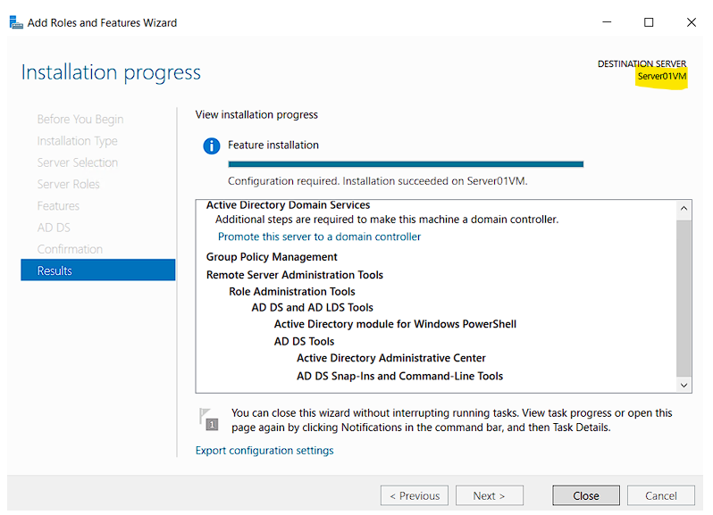
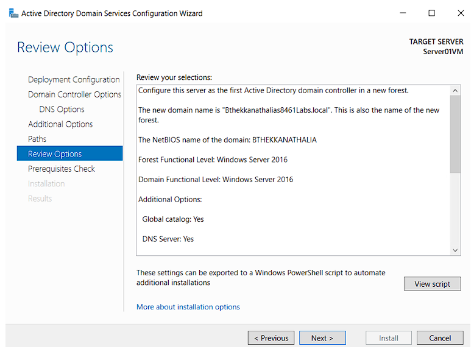
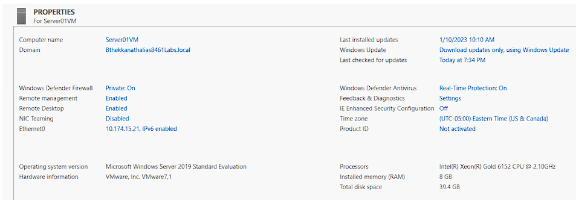
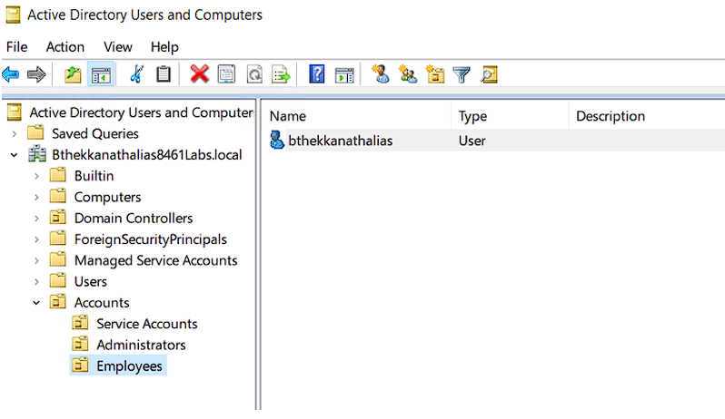
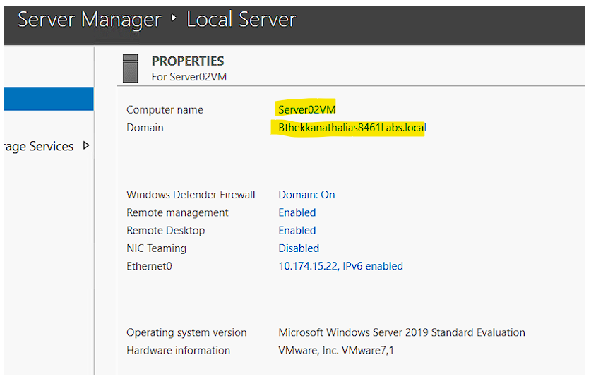
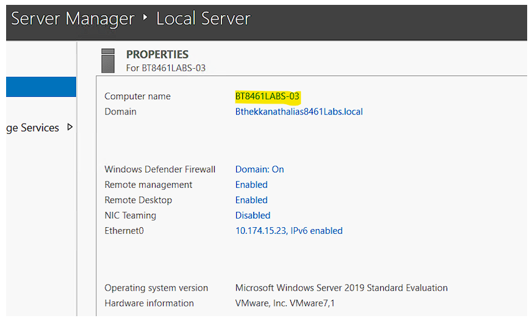
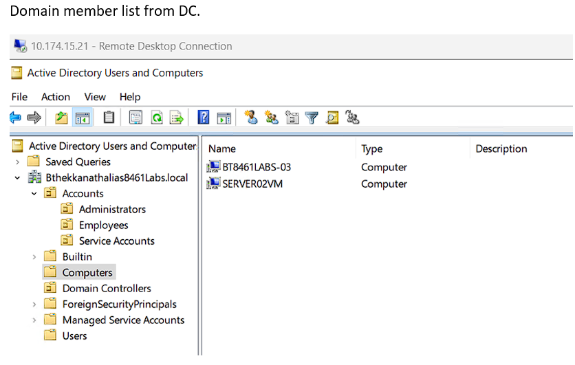
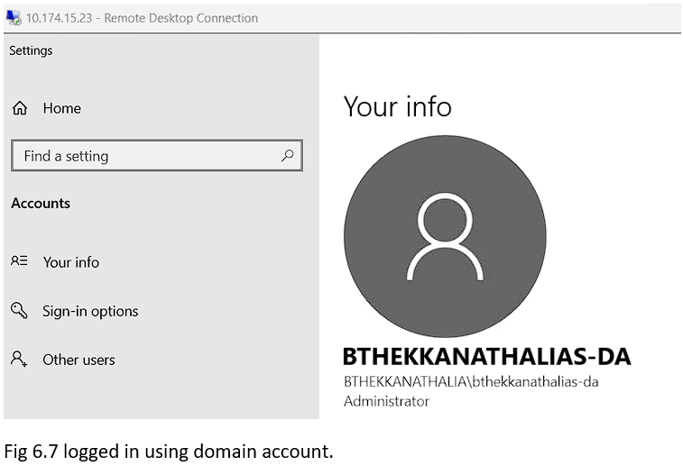
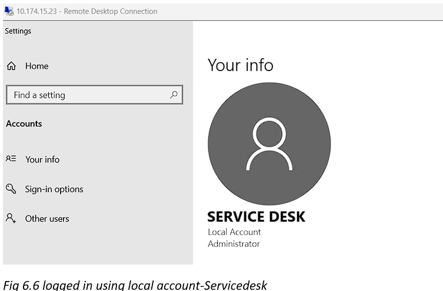

# 🖥️ Windows Server 2019 – Active Directory Domain Services (ADDS) Lab

This project demonstrates the installation, configuration, and management of **Active Directory Domain Services (ADDS)** on Windows Server 2019.  

---

## 📌 Lab Objectives
- Install and configure **Active Directory Domain Services (ADDS)**.
- Promote a server to a **Domain Controller** and create a new forest/domain.
- Create **Organizational Units (OUs)**, groups, and users.
- Configure **DNS** for domain resolution.
- Join multiple servers to the domain as **member servers**.
- Test login with both **local** and **domain accounts**.

---

## 🏗️ Lab Setup
- **Virtualization:** VMware vSphere  
- **OS:** Windows Server 2019 (3 VMs)  
- **Domain:** `bthekkanathalias8461labs.local`  
- **Servers:**
  - `Server01VM` → Domain Controller (10.174.15.21)
  - `Server02VM` → Domain Member (10.174.15.22)
  - `BT8461LABS-03` → Domain Member (10.174.15.23)

---

## 🔑 Key Tasks

### 1️⃣ Install ADDS and Promote Server01 to Domain Controller
- Installed the **Active Directory Domain Services** role.
- Promoted `Server01VM` as a **Domain Controller**.
   

---

### 2️⃣ Create Organizational Units (OUs), Users, and Groups
- Created OU **Accounts** with sub-OUs:
  - Service Accounts
  - Administrators
  - Employees
- Added:
  - Group: `8461Labs-joiners`
  - User: `joiner01` (added to group)
  - User: `bthekkanathalias` (Employee)
  - User: `bthekkanathalias-da` (Domain Admin)
    

---

### 3️⃣ Add Domain Members
- Configured **DNS** of member servers to point to the Domain Controller.
- Joined `Server02VM` and `BT8461LABS-03` to the domain.
  

---

### 4️⃣ Verify Logins
- Successfully logged in using:
  - Local account (`ServiceDesk`)
  - Domain accounts (`joiner01`, `bthekkanathalias`, `bthekkanathalias-da`)
    

---

## 📝 Reflection
This lab provided hands-on experience with:
- Installing and configuring **ADDS**.
- Designing **OU structures** for better account and group management.
- Understanding **DNS integration** with AD.
- Managing **domain member servers** and validating account logins.

---

